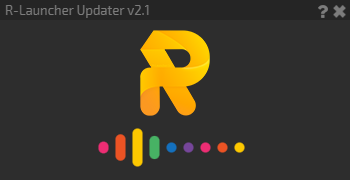
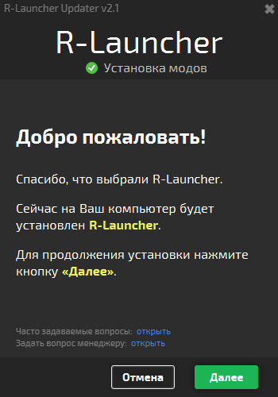
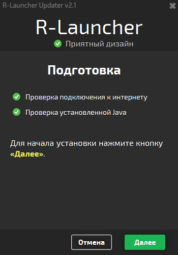
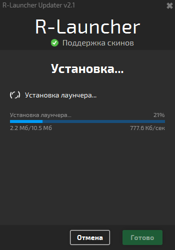
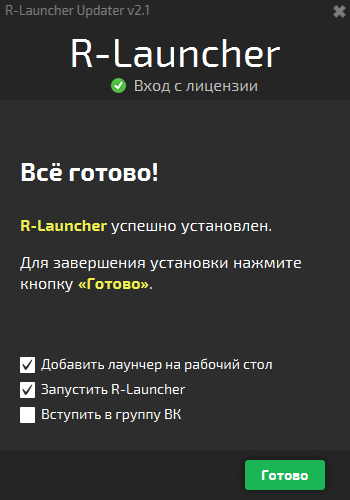

# R-Updater (v2.0)
R-Updater is an application that can install [R-Launcher](https://github.com/VENTO-off/R_Launcher) and JVM on first run. It also checks for updates before running launcher.

## Features
The main features of R-Updater v2.0:
- modern and beautiful design with animations
- installs launcher and JVM (if needed) on first run
- checks if installed JVM is corrupted and if appropriate version installed
- adds desktop shortcut and invites to join social media after installation completed

## Technologies
- Java 8
- JavaFX

## Screenshots

## License
The launcher is licensed under the GNU General Public License v3.0.
